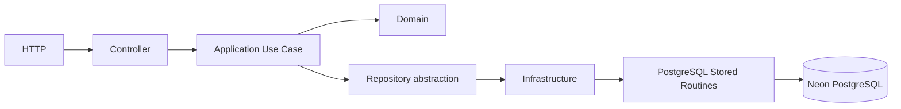

# Architecture

DataGo uses four small Clean Architecture projects:

- **Domain:** customer aggregate, address, catalogs, enums, and business invariants. It has no EF, HTTP, or hosting dependency.
- **Application:** request/response models, repository ports, and reusable create/read/search/update/retire use cases. It has no `DbContext` dependency.
- **Infrastructure:** EF Core `DbContext`, PostgreSQL mappings, migration/seeds, and concrete repositories.
- **API:** composition root, configuration, thin controllers, Swagger, and consistent HTTP error mapping.

Infrastructure executes Npgsql commands only after Application/Domain validation. Procedures atomically persist commands and table-returning functions hydrate aggregates in one read round-trip. EF Core remains responsible for mappings and reproducible migrations. Logical retirement preserves queryability and historical state.

## Future AI Assistant

An assistant will call the same Application use cases as Angular: `Assistant -> Application -> Repository -> Stored Routine`. It will not call controllers, routines, EF, SQL, or the database directly. Mutations—especially update and retirement—will follow `Draft -> Validate -> User Confirmation -> Execute Use Case`. The LLM proposes intent; domain/application code remains the business authority.
