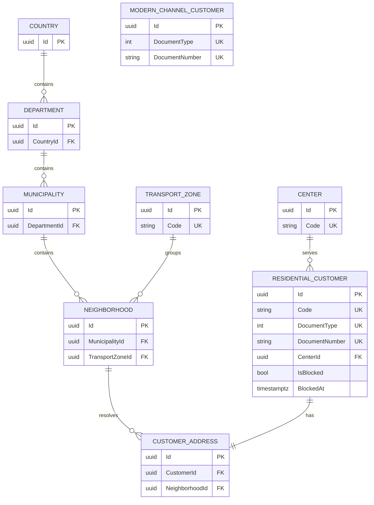

# Database

PostgreSQL is modeled through EF Core and Npgsql. `InitialCreate` owns schema creation and deterministic demonstration seeds, so application startup does not reinsert data.

`(DocumentType, DocumentNumber)` is unique for residential and modern-channel customers. Retirement is logical: `IsBlocked`, `BlockedAt`, and `UpdatedAt` change; no row is deleted. Geography is accepted only through `NeighborhoodId`, whose foreign-key chain resolves municipality, department, country, and transport zone.
